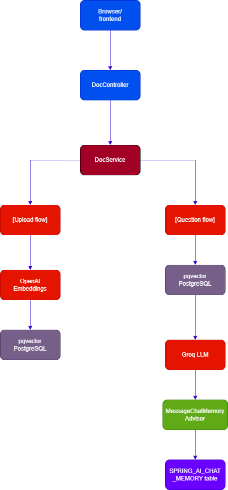

# AI Document Assistant

## What is this?

A RAG (Retrieval Augmented Generation) application that allows users to upload documents and ask questions about them
using AI.

## Architecture

## Tech Stack

- Java + Spring Boot
- Spring AI
- pgvector (PostgreSQL)
- Docker
- OpenAI (Embeddings)

## How it works

1. User uploads document (PDF, DOCX, TXT)
2. Document is extracted, cleaned and split into chunks
3. Chunks are embedded and stored in pgvector
4. User asks a question
5. Question is embedded and compared with stored chunks
6. Top 3 relevant chunks sent to LLM with question
7. LLM responds with streaming

# How to run

### Prerequisites : 
 - Java 17+
 - Maven
 - Docker
 - Git

### Steps
1. Clone the repository
    git clone https://github.com/YashLakkas24/ai_document_assistant.git
    cd AI-Document-Assistant

2. Set environment variables
    OPENAI_API_KEY=your_key_here

3. Start PostgreSQL
   docker-compose up -d 

4. Run the application
   ./mvnw spring-boot:run

5. Open browser
   http://localhost:8080/index.html
